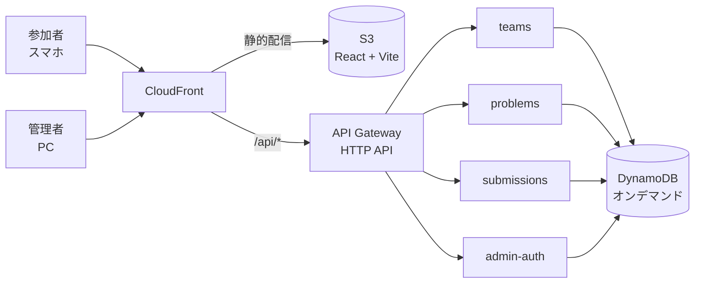

# 謎解きナイト（nazotoki-portal）

社内イベント向けの謎解き大会ポータル。参加者はスマホで4桁の答えを入力し、管理者はブラウザから出題の制御・進行の把握・結果の記録を行う。

**公開URL: https://d28j393tajgb5x.cloudfront.net**

| 用途 | パス | ログイン |
| --- | --- | --- |
| 参加者 | `/login` | チーム共有コード（6桁英数字） |
| 管理コンソール | `/admin/login` | 管理者ID / パスワード |

## どういうイベントを想定しているか

- **全問題が一斉に提示される**。参加者はどれから解いてもよく、画面上で問題を選ぶ導線は持たない。**4桁を打つだけの単一画面**で、サーバーが受付中の全問題から自動で一致を探す。
- 答えは**4桁の数字**。正解パターンのほかに、**マイナス賞金の不正解パターン（トラップ）**を登録できる。
- 再挑戦は無制限だが、**同じパターンで賞金が入るのは1回だけ**（正解コードの連打で賞金を積み増せないようにするため）。
- 参加者に見せるのは**正解 / 不正解だけ**。賞金額・合計・回答履歴は管理者しか見られない。

## 主な機能

### 参加者

- チーム共有コードでログイン（個人アカウント不要。1チームで複数端末から同時に回答できる）
- 大きなタップ式テンキーで4桁を入力し、正解は紙吹雪、不正解はシェイクで演出
- イベント開始前・終了後は入力できず、開始・終了に合わせて**画面が自動で切り替わる**（リロード不要）

### 管理者

| タブ | できること |
| --- | --- |
| 問題管理 | 問題と回答パターンの登録・編集・削除、問題ごとの有効/無効、全問一括切替、CSVの取込/出力 |
| チーム管理 | チームの登録・削除、ログインコードの確認と再発行 |
| ダッシュボード | ランキング、問題別サマリ、チーム別のドリルダウン、**結果CSV出力** |
| 大画面表示 | 会場のプロジェクタへ投影する専用画面。全画面表示に対応 |

**イベントの開始 / 終了**はヘッダーに常設され、どのタブからでも操作できる。

## 出題の制御は2階建てになっている

問題ごとの有効/無効とは**別に**、イベント全体の開始/終了がある。受付の判定は必ず **イベント → 問題** の順で見る。

```
イベントが「開催中」か？ ── いいえ ─→ 受け付けない（記録もしない）
        │ はい
        ▼
その問題が「有効」か？ ──── いいえ ─→ 不正解として扱う（記録しない）
        │ はい
        ▼
    正誤を判定して記録する
```

2つに分けているのは、**全問題をあらかじめ有効にしておいて時刻どおりに一斉開始したい**一方で、**特定の問題だけイベント途中から投入したい**ことがあるため。1つのフラグで兼ねると、開始・終了のたびに全問題を設定し直すことになり、途中投入する予定の問題まで巻き込んで有効化されてしまう。

開始・終了の操作は問題の有効/無効を一切変更しない。終了後に再開しても、それまでの回答記録と問題の設定はそのまま残る。

## 構成

フロントエンドは CloudFront + S3 のSPA、バックエンドは API Gateway (HTTP API) + Lambda + DynamoDB。Cognitoは使わず、認証は各Lambdaが検証する自前のJWT（HS256）。



```text
nazotoki-portal/
├── frontend/         React 19 + Vite + TypeScript + MUI + TanStack Query
├── backend/          Lambda（Node.js 24 / TypeScript / esbuildバンドル）
│   ├── functions/    機能ドメインごとに4関数
│   └── shared/       回答マッチング・認証・イベント状態などの共通ロジック
├── cloudformation/   IaC（素のCloudFormation + rain）
├── docs/             設計ドキュメントとAPI契約
└── .github/workflows/ main への push で自動デプロイ
```

## ドキュメント

| ファイル | 内容 |
| --- | --- |
| [docs/00-design.md](docs/00-design.md) | 設計の背景・データモデル・判定ロジック・画面構成 |
| [docs/01-api-contract.md](docs/01-api-contract.md) | **API契約（実装の唯一の正）**。テーブル定義・全エンドポイント・エラー形式 |
| [frontend/README.md](frontend/README.md) | フロントエンドの構成・起動方法・認証の扱い |
| [backend/README.md](backend/README.md) | Lambdaの構成・環境変数・回答マッチングロジック |
| [cloudformation/README.md](cloudformation/README.md) | スタック構成・デプロイ手順・IAM方針 |

## 開発

Node.js 24系が必要。

```bash
# フロントエンド（http://localhost:5173）
cd frontend && npm ci && npm run dev

# バックエンド
cd backend && npm ci
npm run typecheck   # tsc --noEmit
npm test            # vitest（回答マッチングの単体テスト）
```

バックエンドが起動していなくてもフロントエンドの画面は開ける（API呼び出しはエラー表示になるだけ）。

## デプロイ

`main` への push で [GitHub Actions](.github/workflows/deploy.yml) が動く。typecheck とテストが通ってから、CloudFormationスタック → フロントエンドのビルド・S3同期・CloudFrontのキャッシュ無効化、の順に実行される。AWS認証はOIDCで、アクセスキーは保持していない。

手元から実行する場合:

```bash
cd cloudformation
export JWT_SECRET=...   # 毎回同じ値を使う（変わると発行済みトークンが無効になる）
./deploy.sh

cd ../frontend && npm run build
aws s3 sync dist/ "s3://<FrontendBucketName>/" --delete
aws cloudfront create-invalidation --distribution-id <DistributionId> --paths "/*"
```

## 運用

### イベント前

```bash
# チーム・回答だけを消す（登録済みの問題は残る）
cd backend
AWS_REGION=ap-northeast-1 TABLE_TEAMS=nazotoki-teams \
TABLE_PROBLEMS=nazotoki-problems TABLE_SUBMISSIONS=nazotoki-submissions \
node scripts/reset-event-data.ts --teams --submissions --yes
```

`--yes` を付けなければ削除対象の件数を表示するだけのドライラン。`--teams` / `--submissions` / `--problems` で対象を選べ、無指定なら3テーブルすべてが対象になる。管理者アカウントは削除しない。

**問題データは手作業で登録したもので復元できない**ため、実行前にドライランで対象テーブルを確認すること。問題管理タブのCSV出力でバックアップも取れる。

### 当日の流れ

1. チームを登録し、ログインコードを配布する
2. 出題する問題を有効に、途中投入する問題を無効にしておく
3. 大画面表示を投影する端末で**当日あらためてログインし直す**（トークンの有効期限は24時間。投影中に切れると画面が更新されなくなる）
4. ヘッダーの「▶ 開始」で受付開始
5. 途中投入する問題は、問題管理タブで**その問題だけ**有効にする
6. 「■ 終了」で受付終了 → ダッシュボードから結果CSVを出力

### 初期管理者の作成

管理者を作るAPIは無い。`backend/scripts/seed.ts` をローカルから実行して投入する。

```bash
cd backend
TABLE_ADMINS=nazotoki-admins AWS_REGION=ap-northeast-1 node scripts/seed.ts
```

## 設計上の割り切り

社内イベント用として、以下は意図的に採用していない。

- **回答のレート制限をしない** … 4桁の総当たりへの抑止は、アプリ側の制限ではなくゲームデザイン側（マイナス賞金のトラップ）に委ねる。複数端末でコードを共有して同時に回答する運用を妨げないことを優先した。API Gateway のスロットリングはコスト上限としてのみ設定している。
- **パスワードポリシー・MFAを設けない** … 参加者の受付を簡単にすることを優先。認証は共有コードと自前JWTのみ。
- **集計テーブルを持たない** … チーム数が数十規模のため、ランキングは都度Lambdaで計算する。
