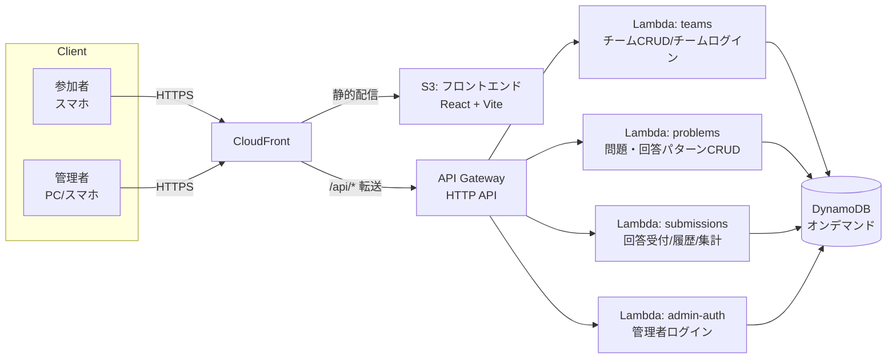

# 謎解きイベント用Webアプリ 設計ドキュメント

## 背景

社内イベント向けの謎解きアプリを新規に作る。参考として既存の `ekiden-portal`（`/Users/wataru/Documents/Development/ekiden-portal`、社内駅伝大会ポータル）の実装・設計ドキュメントを調査済み。ekiden-portalはAWSサーバーレス構成（CloudFront+S3、API Gateway、Lambda、DynamoDB、Cognito）を採用しており、そのIaC・デプロイ運用のノウハウを流用できる。

一方で今回のイベントは要件が異なる：

- 「高いセキュリティ不要・ユーザビリティ優先」（ekiden-portalのCognito招待制認証は過剰）
- 「楽しめるUI・グラフィック」（ekiden-portalは業務システム的で落ち着いたトーン。今回は謎解き/脱出ゲーム風の演出が必要）
- チームの新規登録・削除という管理機能が必要（ekiden-portalは外部システムでエントリー済みの固定名簿を前提にしており、チームの作成/削除機能自体を持たない）
- 「回答は問題との紐付け不要、4桁数字のみ」かつ「複数問題が同時進行」という、ekiden-portalには無い自動判定ロジックが必要

ヒアリングで以下を確定：

- 参加者ログイン: **チーム共有コードでログイン**（個人アカウント不要、Cognito不使用）
- 問題の進行: **すべての問題が一斉に提示される**（順次出題ではない）。参加者はどの問題から解いて回答してもよく、画面側でも問題を指定させる導線は持たない、**単一の回答画面のみ**の仕組みにする
- 問題の受付制御: **時刻期間では管理しない**。各問題に「有効／無効」フラグを持たせ、管理者が問題ごとに切り替える。有効な問題だけが回答対象になる。イベント終了時などには**全問題を一括で有効化／無効化**できる。「進行中」という時間ベースの概念は持たない
- 参加者画面の表示: 正解／不正解のみを表示する。**合計賞金・回答履歴は参加者に見せない**（賞金や達成状況は管理者だけが確認できる）
- 問題登録: 画面フォームからの個別登録に加え、**CSVアップロードによる一括登録**も可能にする
- 未登録の4桁回答: **不正解・賞金0として記録**
- 同一問題への再挑戦: **回数無制限**

この方針に基づき、ekiden-portalのアーキテクチャパターン（Lambda機能ドメイン分割、DynamoDBオンデマンド、CloudFormation+rainでのIaC、共通検証ロジックを`backend/shared/`に集約する流儀）は踏襲しつつ、認証をCognitoから軽量な独自JWT方式に置き換え、UIは謎解きイベントらしい演出に振り切る。

---

## 全体アーキテクチャ

ekiden-portalと同じ「フロントエンドはCloudFront+S3のSPA、バックエンドはAPI Gateway(HTTP API)+Lambda(Node.js/TypeScript)+DynamoDB」という構成を踏襲する。Cognitoは使わず、認証は自前の軽量JWT（HS256、共有シークレット）に置き換える。

- **認証はJWT自前実装**（Cognito不使用）。各Lambdaが共通ミドルウェア（`backend/shared/auth.ts`）でBearerトークンを検証する。理由: 今回は「高いセキュリティ不要・ユーザビリティ優先」であり、Cognitoの招待制メール認証・パスワードポリシーは参加者にとって不要な摩擦になる。チーム共有コードでのログインの方が受付がシンプル。
- **IaC・デプロイ**はekiden-portal同様、素のCloudFormation＋`rain` CLI、`deploy.sh`/`delete.sh`を踏襲（Cognitoスタックが無い分、スタック数はさらに少ない）。CI/CD（CodeCommit+CodeBuild+CodePipeline）は必須にせず、必要なら同じ型を流用可能というオプション扱いにする（イベント規模が小さく、手動`deploy.sh`実行でも運用コストは低い）。
- **DynamoDBはオンデマンドモード**、`Team`/`Problem`/`AnswerPattern`/`Submission`/`AdminUser`のシンプルな複数テーブル構成（ekiden-portalの「アクセスパターンが単純なら単一テーブル設計のメリットは薄い」という判断を踏襲）。

---

## データモデル（DynamoDB）

### Team

| 属性 | 説明 |
| --- | --- |
| PK | `TEAM#<teamId>` |
| teamName | チーム名 |
| loginCode | チーム共有ログインコード（例: 6桁英数字、一意） |
| active | 論理削除フラグ（削除済みチームのログイン・回答は不可にするが、集計上の過去データは残す） |
| createdAt | 作成日時 |

### Problem

| 属性 | 説明 |
| --- | --- |
| PK | `PROBLEM#<problemId>` |
| label | 問題番号/タイトル（例: 「問題3」） |
| enabled | 有効/無効フラグ。`true`の問題だけが回答対象になる。管理者が問題ごとに切り替え、イベント終了時などは一括切替も可能。時刻期間による自動制御は行わない |
| createdAt | 作成日時 |

### AnswerPattern（Problemに紐づく回答パターン）

| 属性 | 説明 |
| --- | --- |
| PK | `PROBLEM#<problemId>` |
| SK | `PATTERN#<patternId>` |
| code | 4桁数字（ゼロ埋め文字列で保持。例: `"0057"`） |
| isCorrect | 正解/不正解フラグ |
| prize | 賞金（整数、マイナス可） |
| note | 管理者向けメモ（任意。例:「逆読みトラップ」） |

- 1つのProblemに対し、正解パターンは通常1件、不正解パターンは0件以上登録できる（「必ず不正解レコードを登録するわけではない」という要件どおり）。

### Submission（回答記録）

| 属性 | 説明 |
| --- | --- |
| PK | `TEAM#<teamId>` |
| SK | `SUBMISSION#<submittedAt>#<submissionId>` |
| code | 参加者が入力した4桁 |
| problemId | 一致した問題ID（未一致の場合は`null`） |
| patternId | 一致した回答パターンID（未一致の場合は`null`） |
| isCorrect | 判定結果 |
| prizeAwarded | このSubmissionで実際に加算された賞金（後述の重複加算防止ロジックにより、初回一致以外は`0`になりうる） |
| submittedAt | サーバー側タイムスタンプ |

- チーム数は社内イベント規模（数十チーム程度）を想定し、管理画面の集計（正誤サマリ・合計賞金・ランキング）はチームごとに`Query`した結果をLambda側でループ集計する（ekiden-portalが「小規模データはLambda側で都度計算し、専用の集計テーブルを持たない」としている方針を踏襲。将来チーム数が数百規模に増える場合はGSI追加を検討）。

### AdminUser

| 属性 | 説明 |
| --- | --- |
| PK | `ADMIN#<adminId>` |
| username | 管理者ID |
| passwordHash | 簡易ハッシュ化パスワード |
| createdAt | 作成日時 |

- 管理者は複数人を個別アカウントで登録可能にする（誰が何を登録したか程度の最低限のトレーサビリティのため）。ただし「高いセキュリティ不要」の方針に沿い、パスワードポリシーやMFAは設けない。

---

## 回答判定ロジック（コアロジック）

`backend/shared/answer-matching.ts` に集約し、管理画面の登録バリデーションと参加者の回答受付Lambdaの両方から呼び出す（ekiden-portalが`backend/shared/team.ts`に検証ロジックを集約した流儀を踏襲）。

### 1. 登録時バリデーション（AnswerPattern作成・編集時／CSV一括取込時）

- 同じ4桁コードが、**有効な他のProblem**（自分自身は除く）のAnswerPatternに既に存在する場合はエラーとし、登録を拒否する。複数問題が同時に有効化されうる仕様上、同時に有効なコードが重複すると参加者の回答がどの問題への回答か一意に定まらなくなるため。CSV一括取込では、取込データ全体を横断して同一チェックを行い、重複行はエラー一覧として提示し、修正するまで取込を確定しない。

### 2. 回答受付時のマッチング（`POST /submissions`）

1. `enabled: true`の**有効な全Problem**を取得する。
2. 有効な問題が1件も無い場合は「現在受付中の問題はありません」として400を返す（回答自体を記録しない）。
3. 有効な全Problemに紐づくAnswerPatternの中から、入力された4桁コードと一致するものを探す。
   - 一致が1件: その`problemId`/`patternId`として判定・記録する。
   - 一致が0件: 未登録の回答として扱い、`problemId: null`・不正解・賞金0で記録する（ヒアリングで確定した仕様）。
   - 一致が複数件（登録時バリデーションにより通常発生しないが、念のためのフォールバック）: 最も早く作成されたProblemの一致を採用し、CloudWatch Logsに警告を出す。
4. **賞金の重複加算防止**: 同一チーム×同一`patternId`の一致が初回かどうかを、そのチームの既存Submission履歴から確認する。初回一致のみ`prizeAwarded`にAnswerPatternの`prize`を設定し、2回目以降の同一パターン一致は`isCorrect`等の判定結果はそのまま表示するが`prizeAwarded: 0`として記録する。
   - 理由: 「回数無制限」で再挑戦を許可すると、正解済みの4桁を連打するだけで賞金を無限に積み増せてしまう抜け穴になる。再挑戦の自由度（間違えても何度でも試せる）は維持しつつ、同じ正解/不正解パターンでの賞金取得は1回限りにすることで、ゲーム性を壊さずに済む。

---

## API設計（Lambda機能ドメイン）

| Lambda | エンドポイント | 用途 |
| --- | --- | --- |
| `teams` | `POST /auth/team-login` | チームコードでログイン、チーム用JWT発行 |
| | `GET /admin/teams`, `POST /admin/teams`, `DELETE /admin/teams/{teamId}`, `POST /admin/teams/{teamId}/regenerate-code` | 管理者向けチーム管理（要admin JWT） |
| `problems` | `GET /admin/problems`, `POST /admin/problems`, `PUT /admin/problems/{problemId}`, `DELETE /admin/problems/{problemId}` | 問題・回答パターンのCRUD（要admin JWT） |
| | `PUT /admin/problems/{problemId}/enabled`, `PUT /admin/problems/enabled`（一括） | 問題の有効/無効切替（個別・全件一括、要admin JWT） |
| | `POST /admin/problems/csv` | CSVによる問題・回答パターンの一括取込（要admin JWT） |
| `submissions` | `POST /submissions` | 参加者の回答送信・判定。レスポンスは正解/不正解のみ（賞金額は返さない）（要team JWT） |
| | `GET /admin/summary` | チームごとの正誤サマリ・合計賞金・ランキング（要admin JWT） |
| | `GET /admin/teams/{teamId}/submissions` | 特定チームの全回答履歴（要admin JWT） |
| `admin-auth` | `POST /admin/login` | 管理者ログイン、admin JWT発行 |

- 認証: 各Lambdaの共通ミドルウェア（`backend/shared/auth.ts`）がAPI Gatewayから渡る`Authorization: Bearer`をHS256共有シークレットで検証し、`{ role: 'team' | 'admin', teamId? }`をペイロードから復元する。admin専用エンドポイントは`role !== 'admin'`なら403。
- JWTの有効期限はイベント継続時間に合わせて短め（例: 24時間）に設定する。

---

## フロントエンド構成

ekiden-portal同様、React + Vite + TypeScriptを踏襲。UIライブラリはMUIを流用しつつ、テーマ（`frontend/src/app/theme.ts`相当）を謎解きイベント向けに作り直す。

### 参加者向け画面

- `/login`: チーム共有コード入力画面
- `/answer`: **単一の回答画面のみ**（問題ごとの画面遷移は無い）
  - 全ての問題は一斉に提示され、参加者はどの問題から解いても自由（順番は問わない）。そのため画面上でも「今どの問題に答えるか」を選択させる導線は持たず、常にこの1画面で4桁を入力するだけでよい（バックエンドの[回答判定ロジック](#回答判定ロジックコアロジック)が有効な全問題から自動で一致を探す設計と対応している）。
  - 大きな4桁テンキー入力UI（スマホでの操作性を優先。物理キーボードのテキスト入力ではなくタップ式の数字パッドを基本にする）。テンキーは3×4グリッドで均等配置し、下段を `⌫`／`0`／`C`（クリア）とする。回答ボタンはグリッド下に全幅で配置する。
  - 送信後、正解/不正解を大きく演出付きで表示（正解: 紙吹雪＋フラッシュ演出、不正解: 軽いシェイク演出）。**賞金額は表示しない。**
  - **合計賞金・回答履歴は参加者画面には表示しない**（賞金・達成状況は管理者だけが確認できる）。参加者は正解/不正解のフィードバックを受け取ったら、そのまま次の問題に挑戦する。

### 管理者向け画面

- `/admin/login`: 管理者ログイン
- `/admin/problems`: 問題一覧・新規登録・編集（問題番号、回答パターン[コード/正誤/賞金/メモ]の追加・編集・削除）。各問題に**有効/無効トグル**を持ち、ツールバーから**全問題の一括有効化/無効化**、および**CSV一括取込**ができる。時刻期間の入力欄は持たない。
- `/admin/teams`: チーム一覧・新規登録・削除、ログインコードの確認・再発行（削除は確認ダイアログ付き）
- `/admin/dashboard`: チームごとのランキング（合計賞金順）、正誤サマリ（問題ごとの正解/不正解回数）、チーム詳細ドリルダウン（問題別の正誤サマリ＋全回答ログ）

### デザイン方向性

- 謎解き/脱出ゲーム風のテーマ: ダークベースの背景に紫・ゴールドなどのネオン系アクセントカラー、装飾的な見出しフォント、正解/不正解時の演出アニメーション。
- ekiden-portalの「業務システム的で落ち着いたトーン」とは逆方向に振り、参加者が「楽しい」と感じる派手さ・遊び心を優先する。
- レスポンシブ必須（参加者は主にスマホ利用を想定）。

---

## インフラ・デプロイ

- ekiden-portalの`cloudformation/`ディレクトリ構成（`templates.conf` + `deploy.sh`/`delete.sh` + `rain` CLI）をベースに、以下のスタック構成に簡略化する:
  1. DynamoDB（`Team`/`Problem`/`AnswerPattern`/`Submission`/`AdminUser`）
  2. Lambda + API Gateway（HTTP API、JWT検証は各Lambda内の共通ミドルウェアで実施。ネイティブJWT AuthorizerはCognito前提のため今回は使わず、Lambda内検証に統一）
  3. S3 + CloudFront（フロントエンドSPA配信、`/api/*`をAPI Gatewayへプロキシ）
- Cognitoスタックが無い分、ekiden-portalよりスタック数・デプロイ手順は少ない。
- CI/CD（CodeCommit+CodeBuild+CodePipeline）は必須にせず、まずは手動`deploy.sh`運用でも良いオプションとして扱う（イベント規模・頻度から見て過剰な可能性があるため、必要になれば同じ型を追加する）。
- コスト最小化方針（オンデマンドDynamoDB、HTTP API、CloudFront PriceClass_200等）はekiden-portalの判断根拠をそのまま踏襲する。

---

## 検証方法

1. ローカルでバックエンドLambdaのユニットテスト（vitest、ekiden-portalの`backend`と同じテスト構成を踏襲）を書き、特に以下を重点的に検証する:
   - 複数アクティブ問題が重なる状況での回答マッチングロジック（一致0件/1件/複数件のケース）
   - 登録時のコード重複バリデーション（時間帯が重なる問題間でのコード衝突検出）
   - 同一パターンへの再一致時の賞金重複加算防止ロジック
2. フロントエンドは`vite dev`でローカル起動し、実際に以下のシナリオをブラウザで手動確認する:
   - チームログイン → 4桁回答送信 → 正解/不正解演出 → 履歴表示
   - 管理者ログイン → 問題・回答パターン登録 → チーム登録 → ダッシュボードでのランキング・サマリ反映確認
3. デプロイ後は`rain deploy`でスタックが正常に作成されることを確認し、CloudFront経由で参加者・管理者双方の画面が想定通り動作することを確認する。
